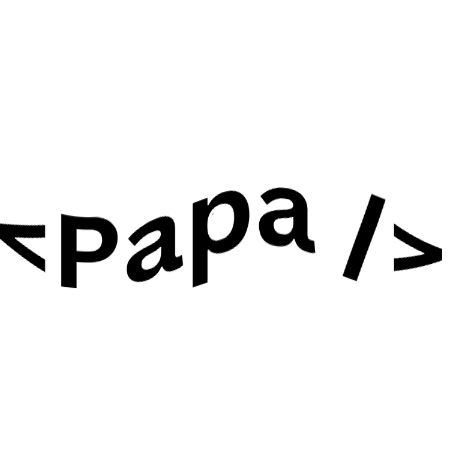

## Hi 👋, I'm Papa Kofi Boahen
 

 

<!-- <h1 align="center">Hi 👋, I'm Papa Kofi Boahen</h1> -->
<h3 align="center">An aspiring frontend UI developer from Ghana, West Africa</h3>

- 🔭 I’m currently working on **[myclean](https://mycleanapp.org/)** join our [beta testers](https://docs.google.com/forms/d/e/1FAIpQLSd7tRTJBNWDIfQ22trZGaYAeYZD0kQlCy5Q1hQ0RgcQK8QCzQ/viewform)

- 🌱 I’m currently learning **Flutter**

- 👨‍💻 All of my projects are available at [https://github.com/Boahen123](https://github.com/Boahen123)

- 📫 How to reach me **papakofiboahen@gmail.com**

- ⚡ Fun fact **I love political history.**

<h3 align="left">Connect with me:</h3>

 

<h3 align="left">Languages and Tools:</h3>

 
  

 
 
 

 
 

 

&nbsp;

